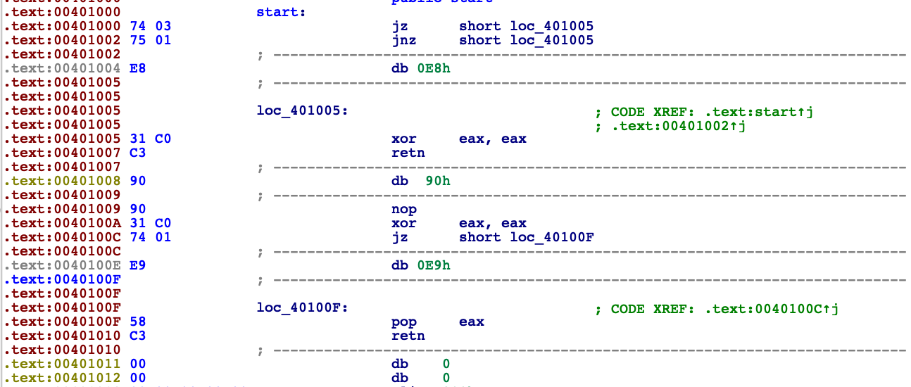
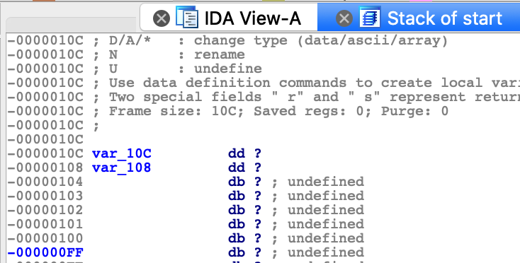
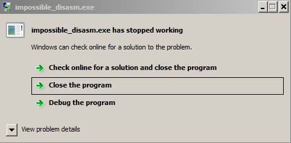
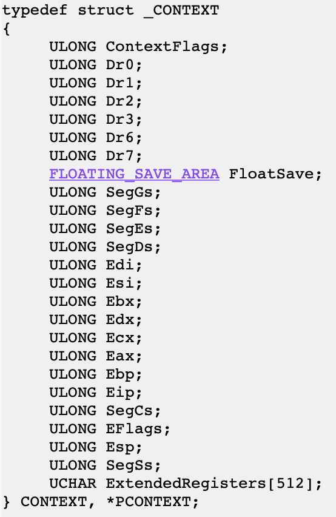
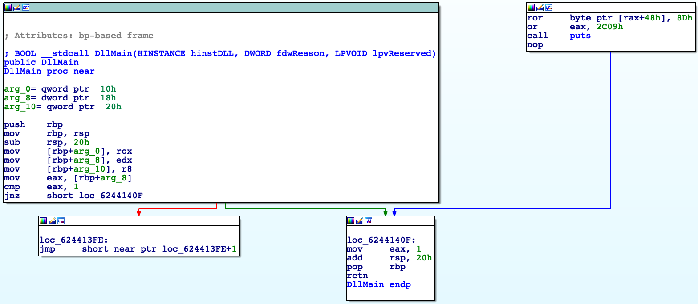
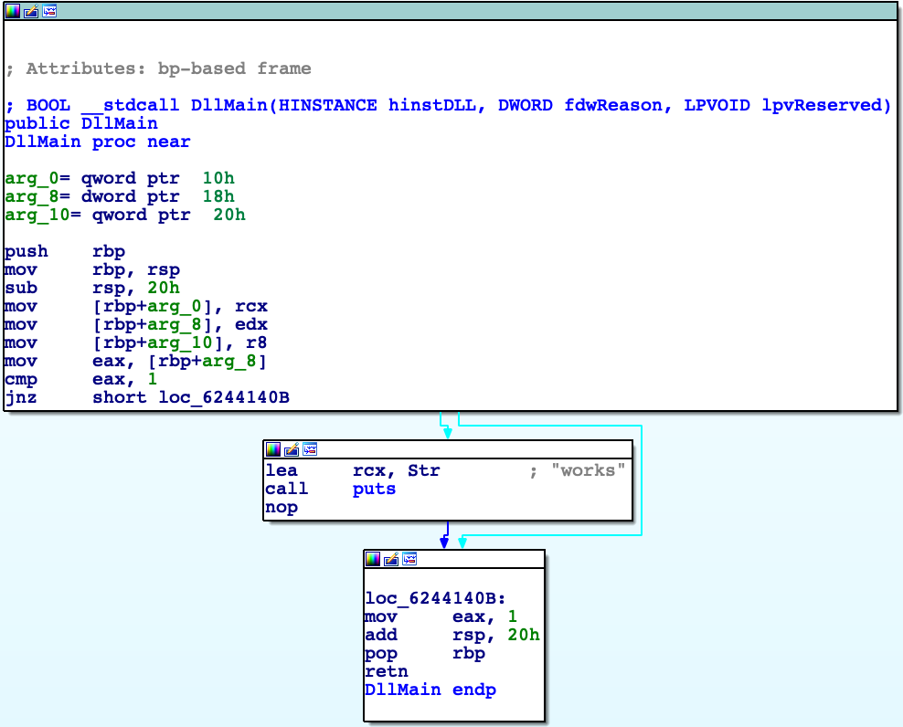
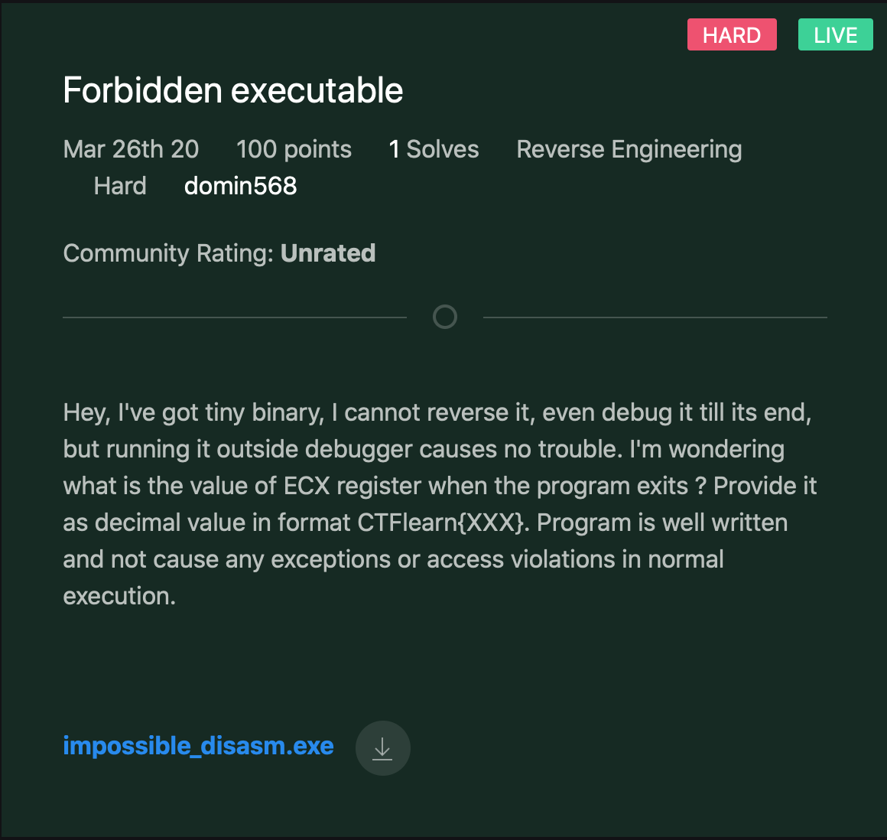

All that comes from my blog [Dominik Tamiołło blog](http://dominiktamiollo.pl)

# je and jne instructions together
------

Take a look at this code      

```

je l1 + 1 ; means one byte after l1 label
jne l1 + 1

l1:
db 0xe8 ; just one byte which starts instruction CALL rel32, refer to x86 instruction set 
xor eax, eax ; l1 + 1
ret
times 2 db 0x90

xor eax,eax
je l2 + 1

l2:
db 0xe9 ; starts instruction JMP rel32
pop eax ; l2 + 1
ret

```

Code starts with mysterious two conditional jump instructions appear. If we locate instruction jump if equal and jump if not equal one below another we end up with unconditional jump. But what flow oriented diassembler does in such scenario ? It tries to locate true and flase branches. For first je it jumps to l1+1 or go to instruction jne l1+1. And what are branches for jne l1+1 ? These are l1 and l1+1. Disassembler can't provide us disassembly view with all these 4 paths. 


Compiler decided to show us scenario when instruction jne l1 + 1 is not true and just go to the next instruction (l1 label). We know that this branch is never going to be taken, but unfortumately IDA doesn't know that. The real path of execution is as shown below. 

```

jmp l + 1

xor eax, eax ; l1 + 1
ret

```

We can change disassemled code in IDA by using D key to change bytes to data and C to disassemble them from other start point. After this action our disassembled code looks like this.



# stack variables mixed up
------

```

sub esp, 8 ; two local variables on stack
sub esp, 4
cmp esp, 0x1000 
jb l1 ; esp never will be below 0x1000 address
add esp, 4
jmp l2

l1:
sub esp, 0x100 ; 64 local variables more

l2:
mov dword [esp], 0xbeefc0de
mov dword [esp+4], 0xc0dec0de
pop eax
pop ecx 
ret

```

Like in example before the problem here is wrong decision what branch should be taken. Stack address is never going to be below 0x1000, that's just how OS'es arrange virtual memory. Now IDA thinks that there are 66 local variables and disassemble is mess.


And check stack by CTRL+K



<div id="sehcontext"> </div>

# call function by exception
------

```

push exception_handler
push dword [fs:0]
mov [fs:0], esp
; 3 lines above set up new exception handler in SEH

xor eax, eax ; eax = 0
div eax ; dividing by 0, raise exception manually

normal_execution: ; code which will never be executed
pop dword [fs:0]
add esp, 4 ; remove exception handler from SEH frames linked list

push 0x40
push paramTitle
push paramText
push 0
call _MessageBoxA@16
ret

exception_handler:
mov ecx, [esp + 0x0c] ; CONTEXT struct 
lea edx, [ecx + 0xb8] ; CONTEXT->EIP
mov dword [edx], redirected_execution ; save redirected function to CONTEXT->EIP 
ret ; 

redirected_execution:
pop dword [fs:0]
add esp, 4 ; remove exception handler from SEH frames linked list 
push 0x40
push paramTitleRedirected
push paramTextRedirected
push 0
call _MessageBoxA@16
ret

```

This code is not that easy to analyse at first glance. Let me introduce you into some windows internals. SEH is Structured Exception Handling abbreviation. It is native exception handling mechanism used in Windows. I'm sure you saw message like this once.



For example your code attempted to divide by 0, program generates exception but there is no user defined handler so the last handler is taken which is responsible for show message about unhandled exception as shown above. SEH allows us to catch this division by 0 and inform program "hey you are doing it wrong, I'm printing message that user supplied wrong numbers and let the program run". SEH frames are stored in linked list with last added element located at FS:0 (for 32 bit code). SEH frame consist of pointer to next frame and handler, we can represent it like that.  
> SEH_frame * next  
  func_pointer exception_handler  

Steps to set new SEH exception handler.  
1. Get current SEH frame address. 
2. Save this address to SEH_frame * next of new frame.
3. Save exception handler to new frame.
4. Register new SEH frame.

In code above SEH frame is built in first three lines. First line set exception function, second actualize pointer to next frame, third save new SEH frame address as first in linked list (dispatched first). When this is set up, code raise division by 0 exception, our exception handler get called.  

Third argument (+0xc on stack) is pointer to CONTEXT structure for current thread (32 bit version).



If we change EIP value in this structure we will redirect execution. After handled exception processor context is taken back to its state before exception occured.   

```

exception_handler:
mov ecx, [esp + 0x0c] ; CONTEXT struct, second argument to function
lea edx, [ecx + 0xb8] ; CONTEXT->EIP,
mov dword [edx], redirected_execution ; save redirected function address to CONTEXT->EIP 
ret ; 

```

First we are getting second argument for this function which is CONTEXT, dereference it and overwrite EIP. Execution flows to redirected_execution. Now stack points to our lastly created SEH frame. Take it to the state before registering new SEH frame and we are clean to return.  
Whole example show us that we can in some way hide calling a function. During static analysis of such program IDA might suppose that redirected_execution is never called, maybe it's some kind of data.


Above we can see redirected_execution block of code interpreted by IDA, totally misleading. Good job, we surprised disassembler. 

# fake ret instruction 
------

```

call $+5 ; this instruction is 5 bytes long
add dword [esp], 5 ; 
ret ; ret and add dword [esp], 5 added together are 5 bytes long
push ebp ; we end up there
mov ebp, esp
mov eax, 0xbeefc0de
pop ebp
ret

```

call $+5 saves onto the stack adress of next instruction (add dword [esp], 5). add dword [esp], 5 adds to this addres 5 which is summary of this instruction itself plus ret. This leads us to situation when ret returns to push ebp (4th line), so it behaves like nop instruction. Disassemblers assume that function ends with ret instruction and this example can confuse IDA. Let us see. 


IDA decided not to disassemble after ret instruction.

# complex nop 
------

Let's take a look at sample code of shared object (inline assembly syntax compatible with MinGW).

```

#include <stdio.h>
#include <windows.h>

void my_puts (const char* arg)
{
     printf("intercepted [%s]\n",arg);
}

BOOL WINAPI DllMain(HINSTANCE hInstDLL,DWORD fdwReason,LPVOID lpvReserved)
{
    switch(fdwReason)
    {
         case DLL_PROCESS_ATTACH:
         {
         	asm (".byte 0xeb");
    	 	asm (".byte 0xff");
    	 	asm (".byte 0xc0");
    	 	asm (".byte 0x48");
	     	puts("works");
         }
         break;
    }
    return TRUE;
}

```

What are these mysterious inline assembly bytes ? Let me explain it by image. 


First instruction that processor spots is jmp $ + 1, then this instruction jumps one byte further and it's inc eax instruction. Next instruction is dec eax so context is not changed by these instructions, we can call it like 4 byte nop. One main difference is fact that this nop mess up disassembly (below case from IDA).



As we can see logic of program is broken, IDA couldn't examine connection between basic blocks well. For comparison disassembly without complex nop below.



More complex example of using this technique and others you can see at my CTF challenge at CTFlearn (click on it).


